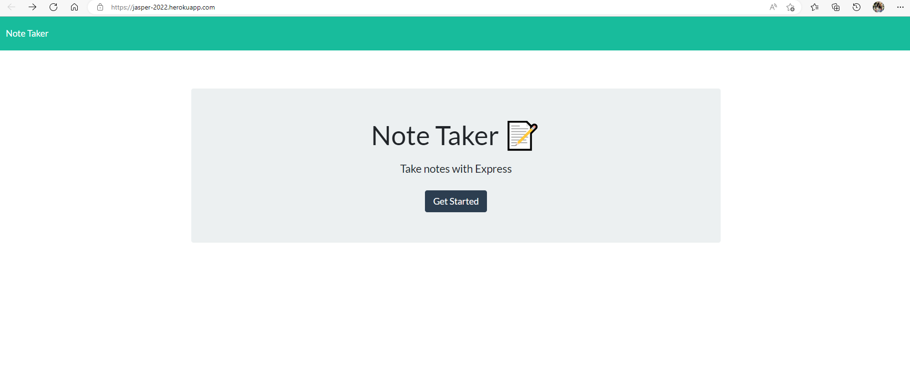

# Note Taker
  

  ## Description
  This application is a Note taker. Users can write and save the notes or delete them.
  Technology: Node js, Express, uuid, heroku  

  ## Web_Img
  

  ## Table of Contents
  * [Web Img](#Web_Img)
  * [Installation](#installation)
  * [Usage](#usage)
  * [App link](#application-link)
  * [License](#license)
  * [Questions](#questions)

  ## Installation 
  Clone or download this repository. Use the command 'npm i' to install all required packages.(require Node)

  ## Usage
  Two way to use the app
  * Use the command 'node server.js' to start the app. Then open the browser and go to localhost:3001 to use it.
  * Use the application link

  ## Application link
  https://jasper-2022.herokuapp.com/
 
  ## License 
  [GPLv3](https://choosealicense.com/licenses/gpl-3.0/)

  ## Questions
  Let me know if you need any help from me, you can contact me at jaspercheng2022@gmail.com. For more detail, please visit https://github.com/hpyorange or https://hpyorange.github.io/JasperWeb/.

 
